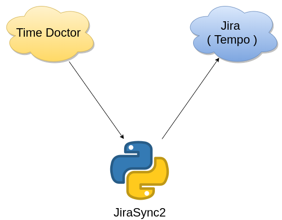
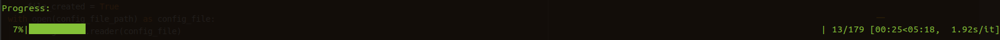
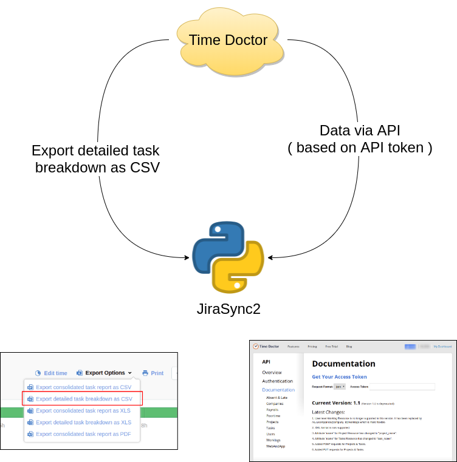
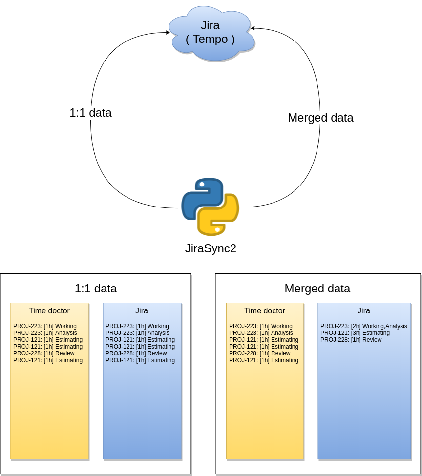
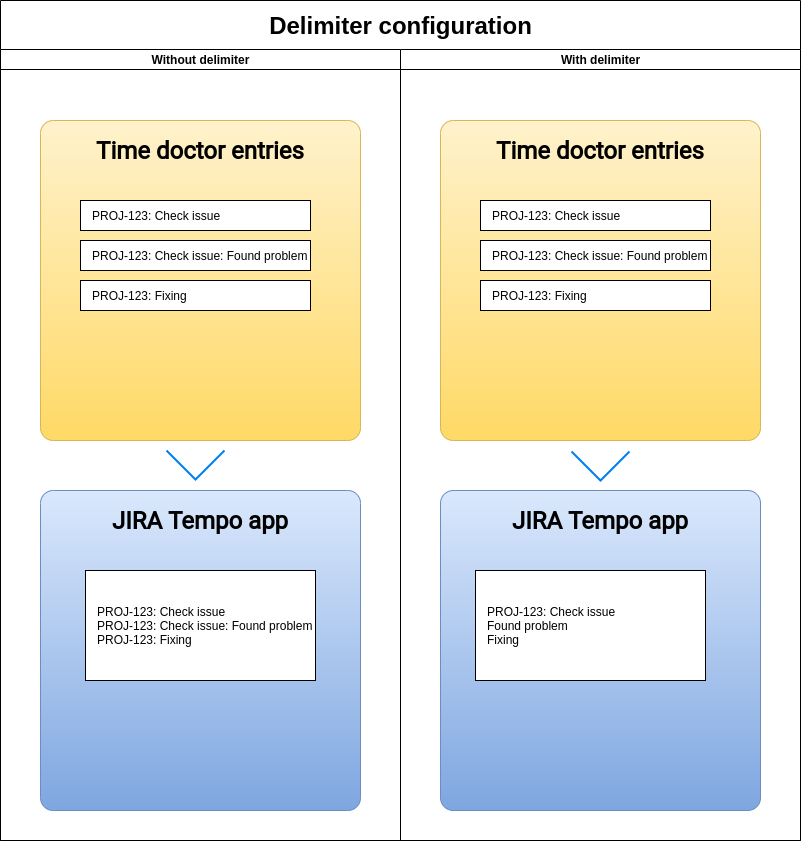

# Jira Time Sync 

_Table of contents_
1. Reason to exists
2. Required packages 
3. What will you need ( Required configuration )
4. Usage
5. How data works 
6. Configuration files
7. Sequence diagrams
8. Additional resources

---

Purpose of this application is to sync data from TimeDoctor application to Jira Tempo app. It's simple Python3 script.



Script gets data from Time Doctor application, process data and send them to Jira ( Tempo ) application.

#### Matching data to Jira tasks
In your time doctor records you should have written JIRA issue ID _( also with project part )_ So i.e. `PROJ-123`. Based on this part, record will be mapped to Jira issue. If you won't have such identifier in your Time doctor record description, then script will ask you for map description to Jira issue number. Once you map it, it won't asks you in further occurence of the same task.


## 1. Reason to exists
In some unresolved circumstances native Timedoctor Jira integrations sometimes creates duplicity for some records. This CLI tool collects data from time doctor ( based on API token ) and send it to Jira Tempo application


## 2. Required packages 

* pip install tabulate
* pip install colored
* pip install termcolor
* pip install tqdm

_*Note:* For proper installation of requirements you can use `requirements.txt` file and pip command:_

```bash
$ pip install -r requirements.txt 
``` 

## 3. What will you need ( Required configuration )
During first run you will be asked for few information, needed for configuration options. In next lines there are explained required data:

* **Jira Base URL**: URL to your Jira project. i.e `something.atlassian.net`. Just open your Jira and copy 
* **Jira API key**: To get your API key you have to visit `Your Account > Security > Create and manage API tokens` - https://id.atlassian.com/manage-profile/security/api-tokens 
* **Jira User login:** Usually your email address you are logging to Jira
* **Tempo API key:** API key for Tempo app. To get one go to `Apps > Tempo > Settings > API Integration` and generate new ( in case you don't have any )
* **Time doctor API key:** You can retrieve one by navigating to https://webapi.timedoctor.com/doc#documentation and clicking to "Get Your Access Token"

* **Logical delimiter:** Described in later chapter "Additional configuration options"

## 4. Usage
Simply run script. It will asks for everything needed. Script is written in **python 3.6**
```bash
$ python3 ./sync.py
```

In case you have linked `python3` to different version of python, you can try to run 
```bash
$ python3.6 ./sync.py
```

Script supports few params you can use: 
* `--dry-run` Script will connect to TimeDoctor app and agregate data, but sending data to Jira will be simulated ( not sent )
* `--file` In case you don't want to get data from time doctor automatically via API, but you want to export file records from Time Doctor, you can use this argument. Usage would be : `python3 sync.py --file=/tmp/my-export-from-td.csv`
* `--debug` Script will be extra chatty. Also if used, example data file will be used ...

During runtime you will be asked for simple questions: 
* What time range you want to sync ( from TD to Jira - Tempo )
* What method you want to use for syncing ( All data vs. Merged data - see section 5.2. ) 


During syncing you should see nice progress bar: 


## 5. How data works 
### 5.1. Time Doctor data
Data from TimeDoctor app can be gather in 2 ways:
* from export file ( directly from TimeDoctor web application )
* from TimeDoctor API endpoints



Which way you choose it's up to you. Results will be the same ;) 

### 5.2. Sync to Jira ( Tempo )
Data can be added to Jira in 2 ways:
* as 1:1
  * Time records will be synced exactly same as they were crated in Time Doctor application _( with same start times and durations )_ _**Note:** In case duration of record in Time Doctor is lower than 1 minute, such record won't be synced._
* merged data
  * Before sending data to Jira directly, time records will be groupped by jira task ( also descriptions and duration ). In this case start times of time entries will be ignored. Records will be added to Jira one after another



## 6. Configuration files
Files with configuration are stored in `data` folder. Script creates 3 configuration files: 
* `data/jira-config.csv`: Stores configuration required for Jira libraries
* `data/td-config.csv`: Stores configuration required for Time Doctor libraries
* `data/tasks_mapping.csv`: Stores configuration for not identified Tasks

#### 6.1 Additional configuration options
* **Logical delimiter:** You can choose to not use it. In case you will enter it, during merging more worklogs into one ( syncing strategies described later ) script will try to split descriptions based on this delimiter. In case he will find duplicate parts, he will not duplicate them to Jira. ( Complicated huh ? :P Check the picture below )

 

## 7. Sequence diagrams

All sequence diagrams you can find on separate documentation page : [Sequence diagrams](docs/sequence-diagrams/diagrams.md)

## 8. Additional resources

### Time doctor API documentation
https://webapi.timedoctor.com/doc

### Jira Tempo API
https://tempo-io.github.io/tempo-api-docs/

### Jira API ( v3 )
https://developer.atlassian.com/cloud/jira/platform/rest/v3/