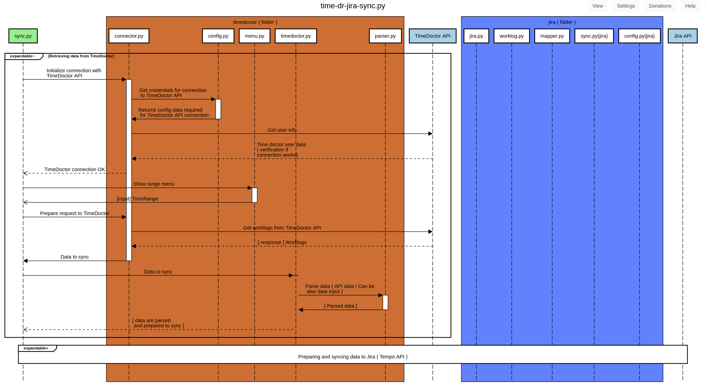

# Sequence diagrams

This document tries to describe how script works from technical ( programming ) point of view .. and

## General Overview

## Retrieving data from Time doctor

## Syncing data to Jira ( Tempo )
 